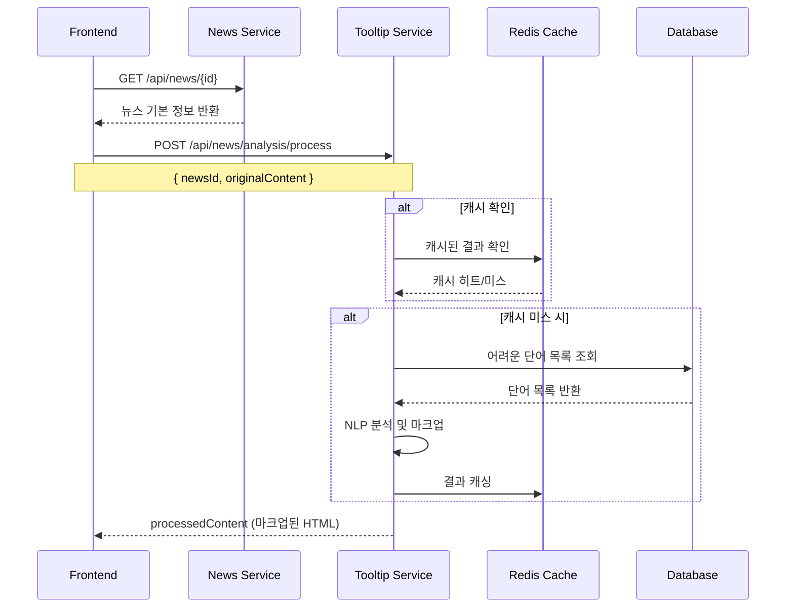
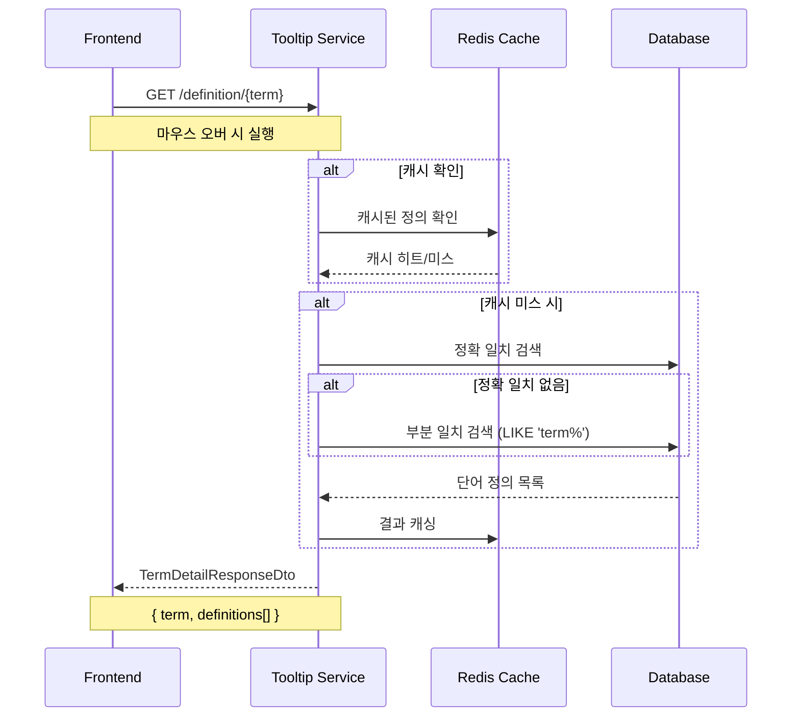
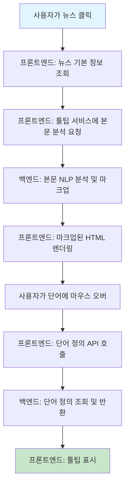

# 툴팁 시스템 전체 플로우 가이드

## 📖 개요

**프론트엔드부터 백엔드까지 완전한 툴팁 기능 구현 플로우**  
**목표**: 뉴스 본문의 어려운 단어에 마우스를 올렸을 때 정의를 툴팁으로 표시

---

## 🔄 전체 시스템 플로우

### **단계별 흐름 개요**

1. **뉴스 로딩 시**: 뉴스 본문 분석 및 마크업
2. **사용자 상호작용**: 마우스 오버 시 단어 정의 조회
3. **툴팁 표시**: 정의 내용을 팝업으로 표시

---

## 📋 Phase 1: 뉴스 본문 분석 및 마크업

### **🎯 시나리오**: 사용자가 뉴스 기사를 클릭했을 때

#### **Step 1: 프론트엔드 뉴스 요청**

```javascript
// 프론트엔드: 뉴스 상세 페이지 로딩
const NewsDetail = ({ newsId }) => {
  const [newsData, setNewsData] = useState(null);
  const [processedContent, setProcessedContent] = useState('');

  useEffect(() => {
    fetchNewsDetail(newsId);
  }, [newsId]);

  const fetchNewsDetail = async (id) => {
    try {
      // 1. 먼저 뉴스 기본 정보 조회
      const newsResponse = await fetch(`${API_BASE_URL}/api/news/${id}`, {
        headers: {
          Authorization: `Bearer ${token}`,
        },
      });
      const news = await newsResponse.json();
      setNewsData(news);

      // 2. 뉴스 본문 분석 요청 (툴팁 마크업)
      await processNewsContent(id, news.content);
    } catch (error) {
      console.error('뉴스 로딩 실패:', error);
    }
  };
};
```

#### **Step 2: 뉴스 본문 분석 API 호출**

```javascript
// 프론트엔드: 툴팁 서비스에 본문 분석 요청
const processNewsContent = async (newsId, originalContent) => {
  try {
    const response = await fetch(`${TOOLTIP_API_BASE_URL}/api/news/analysis/process`, {
      method: 'POST',
      headers: {
        'Content-Type': 'application/json',
      },
      body: JSON.stringify({
        newsId: newsId,
        originalContent: originalContent,
      }),
    });

    if (response.ok) {
      const result = await response.json();
      setProcessedContent(result.processedContent);
    } else {
      // 실패 시 원본 내용 사용
      setProcessedContent(originalContent);
    }
  } catch (error) {
    console.error('본문 분석 실패:', error);
    setProcessedContent(originalContent); // 폴백
  }
};
```

#### **Step 3: 백엔드 처리 플로우**



#### **Step 4: 마크업된 HTML 응답 예시**

```json
{
  "processedContent": "정부가 내년 <span class=\"tooltip-word\" data-term=\"예산\">예산</span>(豫算)을 편성하며 <span class=\"tooltip-word\" data-term=\"경제\">경제</span> 활성화를 위한 <span class=\"tooltip-word\" data-term=\"정책\">정책</span>을 발표했다."
}
```

---

## 🎯 Phase 2: 사용자 상호작용 및 툴팁 표시

### **🎯 시나리오**: 사용자가 `<span>` 태그의 단어에 마우스를 올렸을 때

#### **Step 1: React 컴포넌트 구현**

```jsx
// 프론트엔드: 뉴스 본문 렌더링 컴포넌트
const NewsContent = ({ processedContent }) => {
  const [tooltip, setTooltip] = useState({
    visible: false,
    content: null,
    position: { x: 0, y: 0 },
  });
  const [loadingTooltip, setLoadingTooltip] = useState(false);

  // 마크업된 HTML을 안전하게 렌더링
  const contentRef = useRef(null);

  useEffect(() => {
    if (contentRef.current && processedContent) {
      // HTML 삽입
      contentRef.current.innerHTML = processedContent;

      // 모든 tooltip-word 요소에 이벤트 리스너 추가
      const tooltipWords = contentRef.current.querySelectorAll('.tooltip-word');

      tooltipWords.forEach((element) => {
        element.addEventListener('mouseenter', handleMouseEnter);
        element.addEventListener('mouseleave', handleMouseLeave);
        element.addEventListener('mousemove', handleMouseMove);
      });

      // 클린업
      return () => {
        tooltipWords.forEach((element) => {
          element.removeEventListener('mouseenter', handleMouseEnter);
          element.removeEventListener('mouseleave', handleMouseLeave);
          element.removeEventListener('mousemove', handleMouseMove);
        });
      };
    }
  }, [processedContent]);

  return (
    <div className="news-content">
      {/* 뉴스 본문 */}
      <div ref={contentRef} className="content-body" />

      {/* 툴팁 컴포넌트 */}
      {tooltip.visible && (
        <Tooltip content={tooltip.content} position={tooltip.position} loading={loadingTooltip} />
      )}
    </div>
  );
};
```

#### **Step 2: 마우스 이벤트 핸들러**

```javascript
// 마우스 엔터 시: 단어 정의 조회
const handleMouseEnter = async (event) => {
  const term = event.target.getAttribute('data-term');
  const rect = event.target.getBoundingClientRect();

  if (!term) return;

  // 툴팁 위치 설정
  setTooltip((prev) => ({
    ...prev,
    visible: true,
    position: {
      x: rect.left + rect.width / 2,
      y: rect.top - 10,
    },
  }));

  // 로딩 상태 표시
  setLoadingTooltip(true);

  try {
    // 단어 정의 API 호출
    await fetchTermDefinition(term);
  } catch (error) {
    console.error('단어 정의 조회 실패:', error);
    setTooltip((prev) => ({ ...prev, visible: false }));
  } finally {
    setLoadingTooltip(false);
  }
};

// 마우스 이동 시: 툴팁 위치 업데이트
const handleMouseMove = (event) => {
  setTooltip((prev) => ({
    ...prev,
    position: {
      x: event.clientX,
      y: event.clientY - 10,
    },
  }));
};

// 마우스 리브 시: 툴팁 숨김
const handleMouseLeave = () => {
  setTooltip((prev) => ({ ...prev, visible: false }));
};
```

#### **Step 3: 단어 정의 API 호출**

```javascript
// 단어 정의 조회 함수
const fetchTermDefinition = async (term) => {
  try {
    // URL 인코딩 처리
    const encodedTerm = encodeURIComponent(term);

    const response = await fetch(
      `${TOOLTIP_API_BASE_URL}/api/news/analysis/definition/${encodedTerm}`,
      {
        method: 'GET',
        headers: {
          'Content-Type': 'application/json',
        },
      },
    );

    if (response.ok) {
      const termDetail = await response.json();

      // 툴팁 내용 업데이트
      setTooltip((prev) => ({
        ...prev,
        content: termDetail,
      }));
    } else if (response.status === 404) {
      // 단어를 찾을 수 없음
      setTooltip((prev) => ({
        ...prev,
        content: {
          term: term,
          definitions: [{ definition: '정의를 찾을 수 없습니다.', displayOrder: 1 }],
        },
      }));
    }
  } catch (error) {
    console.error('API 호출 실패:', error);
    throw error;
  }
};
```

#### **Step 4: 백엔드 단어 정의 조회 플로우**



---

## 🎨 Phase 3: 툴팁 UI 컴포넌트

### **Step 1: 툴팁 컴포넌트 구현**

```jsx
// Tooltip.jsx - 툴팁 UI 컴포넌트
const Tooltip = ({ content, position, loading }) => {
  if (loading) {
    return (
      <div
        className="tooltip loading"
        style={{
          left: position.x,
          top: position.y,
          transform: 'translateX(-50%) translateY(-100%)',
        }}
      >
        <div className="tooltip-arrow" />
        <div className="tooltip-content">
          <div className="loading-spinner">로딩 중...</div>
        </div>
      </div>
    );
  }

  if (!content) return null;

  return (
    <div
      className="tooltip"
      style={{
        left: position.x,
        top: position.y,
        transform: 'translateX(-50%) translateY(-100%)',
      }}
    >
      <div className="tooltip-arrow" />
      <div className="tooltip-content">
        {/* 단어 제목 */}
        <div className="tooltip-header">
          <h4 className="term-title">{content.term}</h4>
        </div>

        {/* 정의 목록 */}
        <div className="tooltip-body">
          {content.definitions.map((def, index) => (
            <div key={index} className="definition-item">
              <span className="definition-number">{def.displayOrder}.</span>
              <span className="definition-text">{def.definition}</span>
            </div>
          ))}
        </div>
      </div>
    </div>
  );
};
```

### **Step 2: 툴팁 CSS 스타일**

```css
/* Tooltip.css */
.tooltip {
  position: fixed;
  z-index: 1000;
  background-color: #333;
  color: white;
  border-radius: 8px;
  padding: 0;
  box-shadow: 0 4px 12px rgba(0, 0, 0, 0.3);
  max-width: 300px;
  animation: fadeIn 0.2s ease-in-out;
}

.tooltip-arrow {
  position: absolute;
  bottom: -6px;
  left: 50%;
  transform: translateX(-50%);
  width: 0;
  height: 0;
  border-left: 6px solid transparent;
  border-right: 6px solid transparent;
  border-top: 6px solid #333;
}

.tooltip-header {
  background-color: #444;
  padding: 8px 12px;
  border-radius: 8px 8px 0 0;
  border-bottom: 1px solid #555;
}

.term-title {
  margin: 0;
  font-size: 14px;
  font-weight: bold;
  color: #fff;
}

.tooltip-body {
  padding: 8px 12px;
}

.definition-item {
  margin-bottom: 6px;
  display: flex;
  align-items: flex-start;
}

.definition-item:last-child {
  margin-bottom: 0;
}

.definition-number {
  color: #ffd700;
  font-weight: bold;
  margin-right: 6px;
  min-width: 16px;
}

.definition-text {
  font-size: 13px;
  line-height: 1.4;
}

.loading-spinner {
  text-align: center;
  padding: 8px;
  font-size: 12px;
  color: #ccc;
}

/* 어려운 단어 스타일 */
.tooltip-word {
  background-color: #e8f4fd;
  border-bottom: 1px dotted #0066cc;
  cursor: help;
  transition: background-color 0.2s ease;
}

.tooltip-word:hover {
  background-color: #d1e7fd;
}

@keyframes fadeIn {
  from {
    opacity: 0;
    transform: translateX(-50%) translateY(-100%) scale(0.9);
  }
  to {
    opacity: 1;
    transform: translateX(-50%) translateY(-100%) scale(1);
  }
}
```

---

## 🚀 Phase 4: 성능 최적화 및 사용자 경험

### **1️⃣ 디바운싱으로 API 호출 최적화**

```javascript
// 디바운싱을 통한 API 호출 최적화
const useDebouncedTooltip = () => {
  const [debouncedTerm, setDebouncedTerm] = useState('');
  const debounceTimer = useRef(null);

  const showTooltip = (term) => {
    // 이전 타이머 클리어
    if (debounceTimer.current) {
      clearTimeout(debounceTimer.current);
    }

    // 300ms 후에 API 호출
    debounceTimer.current = setTimeout(() => {
      setDebouncedTerm(term);
    }, 300);
  };

  const hideTooltip = () => {
    if (debounceTimer.current) {
      clearTimeout(debounceTimer.current);
    }
    setDebouncedTerm('');
  };

  return { debouncedTerm, showTooltip, hideTooltip };
};
```

### **2️⃣ 클라이언트 캐싱**

```javascript
// 클라이언트 사이드 캐싱
const useTermCache = () => {
  const cache = useRef(new Map());

  const getCachedTerm = (term) => {
    return cache.current.get(term);
  };

  const setCachedTerm = (term, data) => {
    // 최대 100개까지만 캐시
    if (cache.current.size >= 100) {
      const firstKey = cache.current.keys().next().value;
      cache.current.delete(firstKey);
    }
    cache.current.set(term, data);
  };

  return { getCachedTerm, setCachedTerm };
};

// 사용 예시
const fetchTermDefinition = async (term) => {
  // 캐시 확인
  const cached = getCachedTerm(term);
  if (cached) {
    setTooltip((prev) => ({ ...prev, content: cached }));
    return;
  }

  // API 호출 후 캐싱
  const data = await callAPI(term);
  setCachedTerm(term, data);
  setTooltip((prev) => ({ ...prev, content: data }));
};
```

### **3️⃣ 에러 처리 및 폴백**

```javascript
// 포괄적인 에러 처리
const handleTooltipError = (error, term) => {
  console.error('툴팁 오류:', error);

  // 폴백 툴팁 표시
  setTooltip((prev) => ({
    ...prev,
    content: {
      term: term,
      definitions: [
        {
          definition: '일시적으로 정의를 가져올 수 없습니다. 잠시 후 다시 시도해주세요.',
          displayOrder: 1,
        },
      ],
    },
  }));

  // 에러 로깅 (선택사항)
  // trackError('tooltip_api_error', { term, error: error.message });
};
```

---

## 📊 전체 데이터 플로우 요약

### **🔄 완전한 엔드투엔드 플로우**



### **🎯 API 호출 패턴**

```javascript
// 1단계: 뉴스 로딩 시 (한 번만)
POST /api/news/analysis/process
{
  "newsId": 12345,
  "originalContent": "정부가 내년 예산을 편성했다..."
}

// 2단계: 마우스 오버 시 (사용자 액션마다)
GET /api/news/analysis/definition/예산
GET /api/news/analysis/definition/경제
GET /api/news/analysis/definition/정책
```

---

## ⚡ 성능 고려사항

### **1️⃣ 백엔드 최적화**

- **Redis 캐싱**: 24시간 TTL로 반복 요청 최적화
- **DB 인덱싱**: `vocabulary_term.term` 필드 인덱스
- **부분 일치 최적화**: `LIKE 'term%'` 쿼리 성능

### **2️⃣ 프론트엔드 최적화**

- **디바운싱**: 300ms 지연으로 불필요한 API 호출 방지
- **클라이언트 캐싱**: 100개 단어까지 메모리 캐시
- **레이지 로딩**: 마우스 오버 시에만 API 호출

### **3️⃣ 사용자 경험**

- **로딩 인디케이터**: 즉시 툴팁 표시 후 내용 로딩
- **부드러운 애니메이션**: CSS 트랜지션 효과
- **반응형 위치**: 화면 경계 고려한 툴팁 위치 조정

---

## 🔧 실제 구현 예시

### **메인 뉴스 컴포넌트**

```jsx
// NewsDetailPage.jsx
const NewsDetailPage = ({ newsId }) => {
  const [newsData, setNewsData] = useState(null);
  const [processedContent, setProcessedContent] = useState('');

  // 뉴스 로딩 및 본문 분석
  useEffect(() => {
    const loadNews = async () => {
      try {
        // 1. 뉴스 기본 정보
        const news = await fetchNews(newsId);
        setNewsData(news);

        // 2. 본문 분석 (툴팁 마크업)
        const processed = await processContent(newsId, news.content);
        setProcessedContent(processed);
      } catch (error) {
        console.error('뉴스 로딩 실패:', error);
      }
    };

    loadNews();
  }, [newsId]);

  return (
    <div className="news-detail">
      <h1>{newsData?.title}</h1>
      <div className="news-meta">
        <span>{newsData?.press}</span>
        <span>{newsData?.publishedAt}</span>
      </div>

      {/* 툴팁 기능이 적용된 본문 */}
      <NewsContent processedContent={processedContent} />
    </div>
  );
};
```

이제 **완전한 툴팁 시스템**이 구축되었습니다! 🎉

**사용자가 뉴스를 읽으면서 어려운 단어에 마우스를 올리기만 하면, 실시간으로 정의가 표시되는** 직관적이고 부드러운 사용자 경험을 제공합니다! ✨

---

_문서 버전: v1.0_  
_최종 수정일: 2025-08-29_  
_작성자: AI Assistant_
